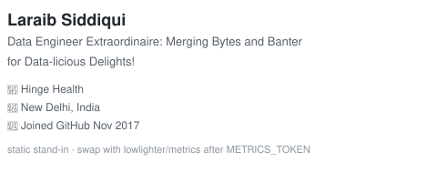
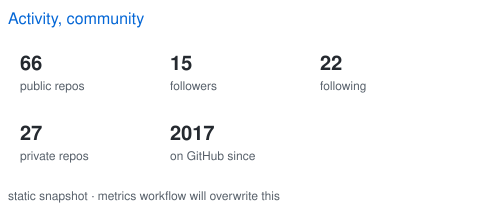
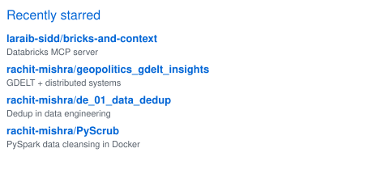
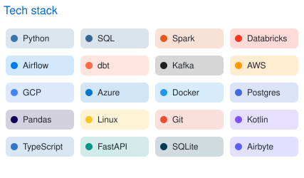
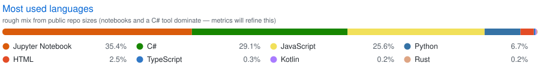
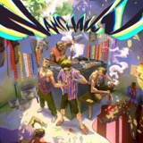

##### Hi, I'm Laraib 👋
> Data engineer at Hinge Health. Bytes, banter, and pipelines that (mostly) don't page at 3am.
>
> Want to know what I'm currently working on?
>
> *PS: side projects keep stacking while the day job ships lakehouse work. Slow is still motion.*
>
> - [ ] [`jupiter-trading`](https://github.com/laraib-sidd/jupiter-trading) paper-trading loop (live path behind `dry_run`)
> - [ ] [`bricks-and-context`](https://github.com/laraib-sidd/bricks-and-context) Databricks MCP — warehouses, jobs, multi-workspace
> - [ ] [`khidki`](https://github.com/laraib-sidd/khidki) on-device SMS forwarding, only while a window is open
> - [ ] Spark / Delta / Airflow muscle memory — the boring stuff that actually pays
> - [ ] this profile, apparently
>
> *Thanks for stopping by. Open to collaborations that involve data, not vibes-only AI wrappers.*

<!--
  LAYOUT RULES (same as a profile that actually measured GitHub markdown):
   1. GitHub forces display:block on every markdown image, so two columns need align left/right floats.
   2. width="47%" holds in the readme column; 49% wraps.
   3. Each row ends with a 100%-wide placeholder as the clear.
-->

<table>
<tr>
<td valign="top" width="50%">

**On the shelf**  
films, anime, manga I keep coming back to

<table>
<tr>
<td></td>
<td>Memories of Murder Bong Joon-ho · 2003</td>
</tr>
<tr>
<td></td>
<td>Dhol Priyadarshan · 2007</td>
</tr>
<tr>
<td></td>
<td>Attack on Titan Hajime Isayama</td>
</tr>
<tr>
<td></td>
<td>Hunter x Hunter Yoshihiro Togashi</td>
</tr>
<tr>
<td></td>
<td>Vinland Saga Makoto Yukimura</td>
</tr>
<tr>
<td></td>
<td>Vagabond Takehiko Inoue</td>
</tr>
<tr>
<td></td>
<td>Berserk Kentaro Miura</td>
</tr>
</table>

</td>
<td valign="top" width="50%">

**On repeat, what I code to**  
Delhi hip-hop + the usual American canon

<table>
<tr>
<td></td>
<td><a href="https://www.youtube.com/watch?v=3isktZOqq0c">Pyar+Tum</a> Nanku</td>
</tr>
<tr>
<td></td>
<td><a href="https://www.youtube.com/results?search_query=Seedhe+Maut+Nanchaku">Nanchaku</a> Seedhe Maut · MC STAN</td>
</tr>
<tr>
<td></td>
<td><a href="https://www.youtube.com/results?search_query=Raga+Midtown+Madness">Midtown Madness</a> Raga</td>
</tr>
<tr>
<td></td>
<td><a href="https://www.youtube.com/watch?v=ZAfAud_M_mg">Flashing Lights</a> Kanye West</td>
</tr>
<tr>
<td></td>
<td><a href="https://www.youtube.com/watch?v=tvTRZJ-4EyI">HUMBLE.</a> Kendrick Lamar</td>
</tr>
</table>

</td>
</tr>
</table>
